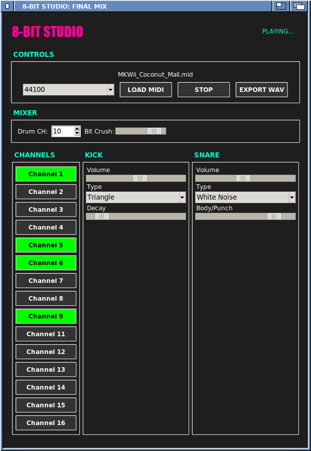

# 🎹 8-Bit Studio - MIDI to Chiptune Converter


A powerful Python synthesizer that converts standard MIDI files into authentic 8-bit / chiptune music in real-time. Inspired by classic consoles like the NES and Gameboy.

Features: Live Playback, Real-time Synthesis, and **WAV Export**!



## ✨ Features

*   **Real-time Synthesis:** No samples used; all audio is mathematically generated on the fly.
*   **Smart Drum System:** Automatically detects the drum track (Channel 10).
    *   **Kick Drum:** Customizable types (Sine, Triangle, Pulse, Noise) + Decay Control.
    *   **Snare Drum:** Hybrid synthesis (Noise + Tonal Body) for a punchy sound.
*   **Bitcrusher:** Simulate vintage sound chips by reducing the bit depth.
*   **Melody Customization for each Channel:**
    *   **Waveforms:** Pulse, Triangle, Sawtooth.
    *   **Pulse Width:** Adjust the duty cycle for that classic "nasal" NES sound.
    *   **Panning:** Adjust which speaker the channel comes from.
    *   **Envelope control:** Change how the amplitude behaves during each notes lifespan.
    *   **Pulse Width Automation:** Add PW sliding effects on note or global time.
*   **WAV Export:** Renders the song faster than real-time into a high-quality WAV file.

## 🛠 Installation

1.  **Install Python:** Make sure you have Python 3.11 or newer installed.

2.  **Clone the repository:**
    ```bash
    $ git clone https://github.com/cosyfluf/8BIT-studio.git
    $ cd 8BIT-studio
    ```

3.  **Install dependencies:**
    ```bash
    $ pip install -r requirements.txt
    ```

## 🚀 Usage

**Running the app:**

You can run the application like follows:
```bash
$ 8bit-studio.py
```

**The user interface**

The user interface has the following components:

*   **Status display** - This shows what the program is currently doing
*   **Controls:**
    * **Sampling rate** - Defaults to 44100, can be changed to preset values
    * **Load MIDI** - Opens a file opening dialog to load a midi file
    * **Play/Stop** - Starts or stops real-time playback
    * **Export WAV** - Stores the processed audio into a file
*   **Mixer:**
    * **Drum CH** - The channel to be used for drums, should always be 10 but can be changed it required.
    * **Bit Crush** - Lower values = coarser audio resolution
*   **Channels (applies for each):**
    * **Volume** - How loud the channel will be mixed into the result
    * **Waveform** - The type of waveform to be played, can be *Pulse*, *Triangle* or *Saw*
    * **Pulse Width** - The PWM dutycycle for the channel (only active if Waveform = Pulse)
    * **Pan** - Which speaker should get the audio how strong
    * **Envelope** - Behaviour of the notes amplitude over time
    * **PW Automation** - Slide the dutycycle from PW Start to PW Stop over the notes duration
    * **PW Bounce** - Ignore note duration and sync PW to global clock. Can be used like an AM drone on low values
*   **Kick:**
    * **Volume** - How loud to mix the kick drum
    * **Type** - The type of kick, can be *Triangle*, *Sine*, *Pulse* or *Noise*
    * **Decay** - How long should the drum play for
*   **Snare:**
    * **Volume** - How loud to mix the snare drum
    * **Type** - The type of snare, can be *White Noise*, *Digital*, or *Metal*
    * **Body/Punch** - Proporting of body (primary tone) and punch (secondary tone)
